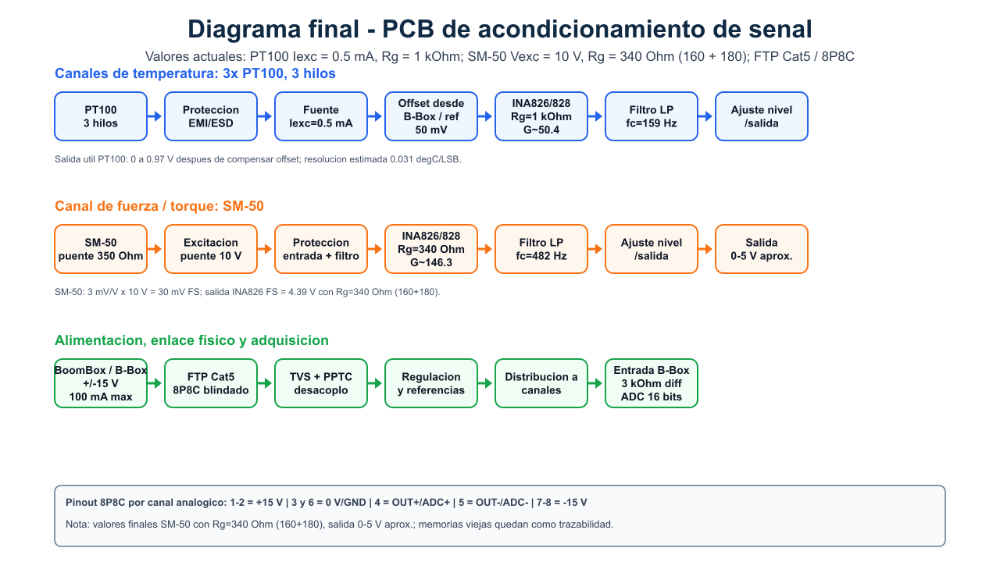
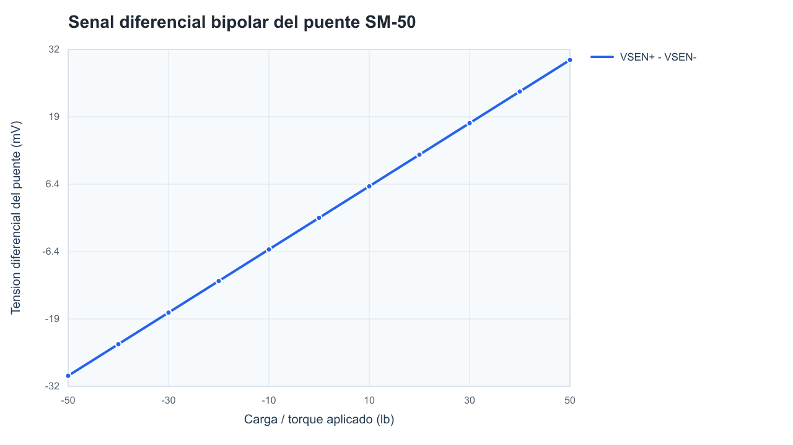
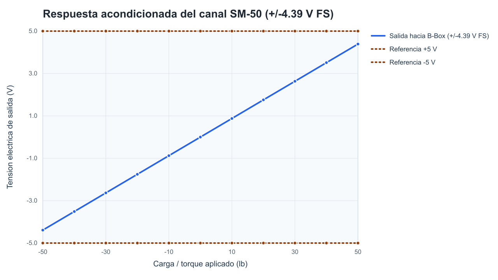

# Tarjeta de acondicionamiento de señales PT100 y SM-50

Diseño e implementación de una tarjeta de acondicionamiento de señales para sensores de torque y temperatura en un motor de inducción trifásico del LabCES. La PCB adapta las señales de un sensor de temperatura PT100 y un sensor de torque SM-50 para facilitar su adquisición y monitoreo dentro de un sistema de medición.

## Objetivo

Diseñar e implementar una tarjeta de circuito impreso que permita acondicionar y adaptar las señales provenientes de los sensores de torque y temperatura de un motor de inducción utilizado en el LabCES, con el propósito de facilitar su correcta adquisición y monitoreo para analizar el desempeño del motor.

## Objetivos específicos

1. Comprender los fundamentos básicos del diseño de tarjetas de circuito impreso y su aplicación al acondicionamiento de señales usando KiCad.
2. Verificar el funcionamiento de los sensores de torque y temperatura mediante simulaciones y pruebas experimentales.
3. Diseñar una PCB que integre el circuito necesario para acondicionar las señales de los sensores.
4. Implementar y probar el prototipo, evaluando su desempeño dentro del sistema de medición del motor de inducción en el LabCES.
5. Mantener un repositorio Git con archivos de diseño electrónico, documentación técnica e historial de desarrollo.

## Vista del diseño

### Esquemático KiCad

### PCB en KiCad

  

### PCB 3D

  

## Diagrama de bloques

Nota de adquisicion: la lectura maxima del ADC de la B-Box se toma como +/-5 V (10 V de span), por lo que la salida bipolar nominal del SM-50 se mantiene en +/-4.39 V para conservar margen de medicion.

## Simulaciones

### Canal PT100

### Canal SM-50

### Esquemáticos LTspice

[PDF PT100](docs/figuras/ltspice_pt100_esquematico.pdf)

[PDF SM-50](docs/figuras/ltspice_sm50_esquematico.pdf)

## Estructura del repositorio

| Ruta | Contenido |
| --- | --- |
| `PCB_PT100_SM50/` | Proyecto KiCad principal: esquemático, PCB, librerías locales, footprints y modelos 3D. |
| `ProyectoPCB_LTspice_PT100_SM50/` | Simulaciones LTspice de los canales PT100 y SM-50. |
| `docs/figuras/` | Imágenes/PDF del esquemático, PCB, vista 3D, LTspice y gráficas. |
| `docs/simulacion/` | CSV, resumen numérico y cálculos finales usados para las gráficas y tablas. |
| `docs/validacion/` | Reportes finales ERC/DRC. |
| `docs/fabricacion/` | ZIP Gerber final con archivo de taladros. |
| `docs/resumen/` | Resumen ejecutivo final del proyecto. |
| `docs/poster/` | Póster final usado para la presentación del proyecto. |
| `docs/bitacora/` | Bitácora actualizada del proceso, en PDF y fuente LaTeX. |
| `docs/referencias/` | Resumen de verificación de footprints y documentos de entrega conservados. |
| `scripts/` | Script para regenerar figuras de simulación y vistas documentales LTspice. |

## Estado final

- KiCad ERC: `0` errores, `0` advertencias.
- KiCad DRC: `0` violaciones, `0` pads desconectados, `0` errores de footprints.
- Paridad esquemático-PCB: `0` problemas.
- ZIP para fabricar: `docs/fabricacion/PCB_PT100_SM50_GERBERS_CON_DRILL.zip`.
- Reportes: `docs/validacion/erc_final_20260626.rpt` y `docs/validacion/drc_final_20260626.rpt`.

## Cómo revisar

1. Abrir `PCB_PT100_SM50/PCB_PT100_SM50.kicad_pro` en KiCad 9.
2. Ejecutar ERC desde el editor esquemático.
3. Ejecutar DRC con comprobación de paridad esquemático-PCB desde el editor PCB.
4. Revisar las simulaciones en `ProyectoPCB_LTspice_PT100_SM50/`.
5. Subir a fabricación el ZIP `docs/fabricacion/PCB_PT100_SM50_GERBERS_CON_DRILL.zip` si se requiere fabricar esta revisión.

## Documentación

- [Reporte formal IEEE PCB PT100/SM-50](docs/reporte_ieee/ReporteFormalPCB_PT100_SM50.pdf)
- [Informe de desarrollo del proyecto](docs/INFORME_DESARROLLO_PROYECTO.md)
- [Resumen ejecutivo](docs/resumen/ResumenEjecutivoKDVJC09331.pdf)
- [Proceso de diseño y trazabilidad](docs/PROCESO_DISENO_TRAZABILIDAD.md)
- [Bitácora actualizada del proyecto](docs/bitacora/bitacora_PCB_actualizada_27_06_2026.pdf)
- [Póster final](docs/poster/vizcaino-jimenez.pdf)
- [Validación final](docs/VALIDACION.md)
- [Referencias técnicas y footprints](docs/REFERENCIAS_TECNICAS.md)

## Herramientas

- KiCad 9.0.7
- LTspice
- Python 3 para generar figuras documentales
- Git / GitHub
