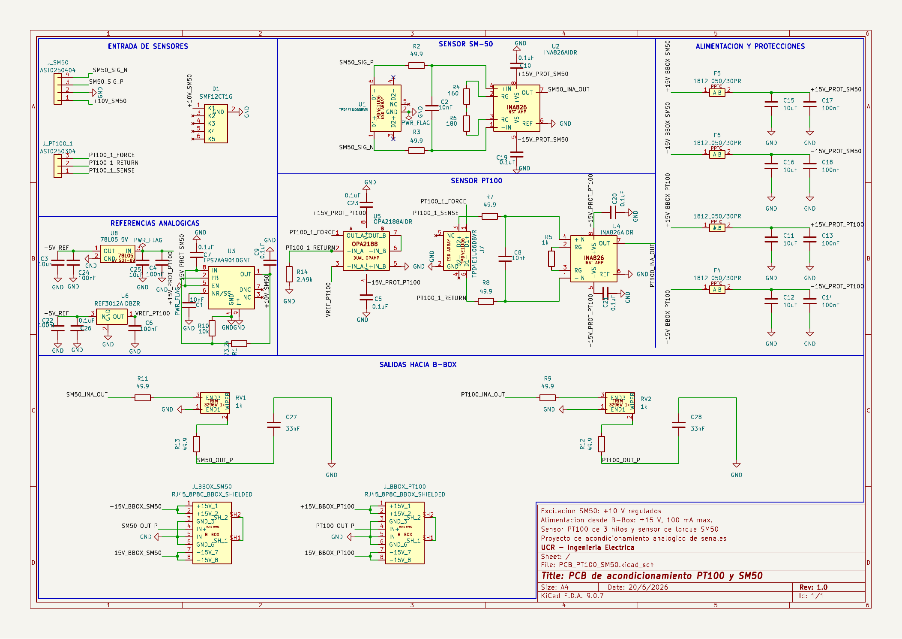
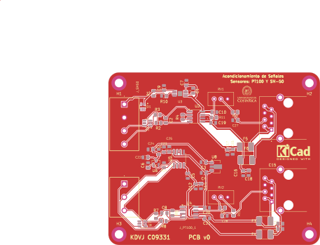
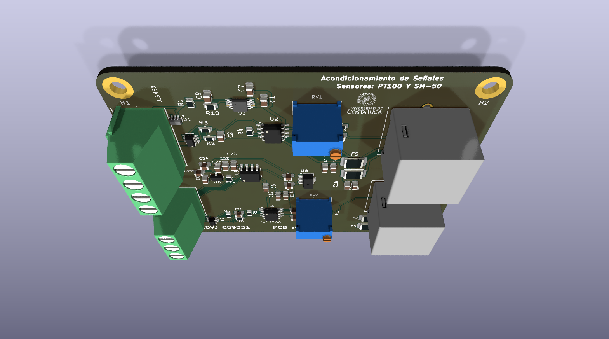
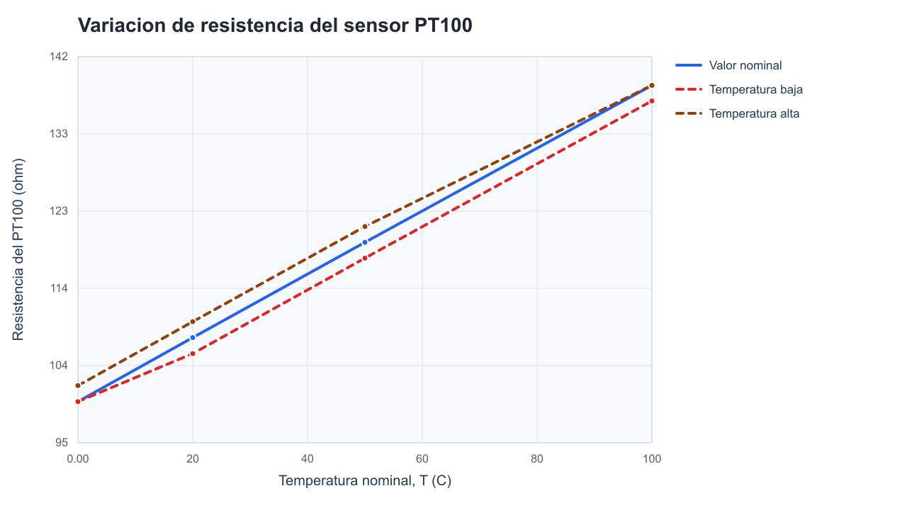
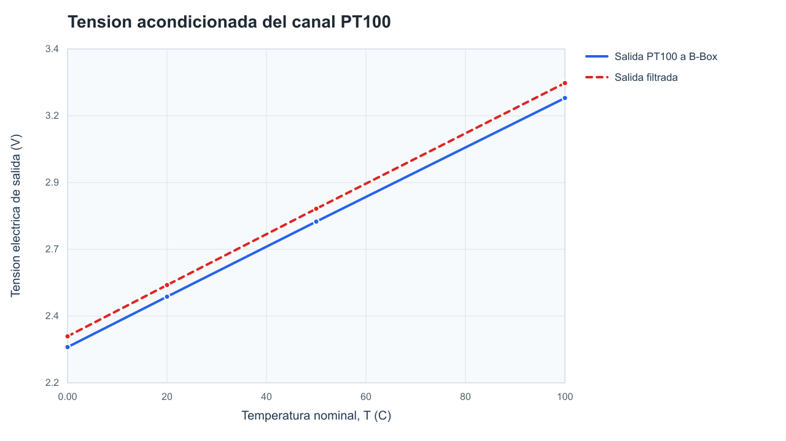
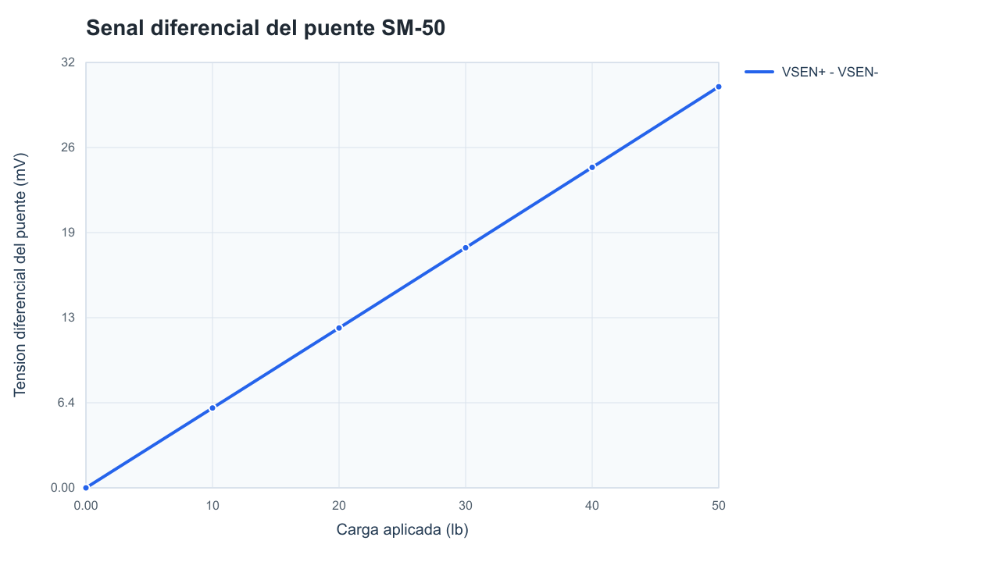
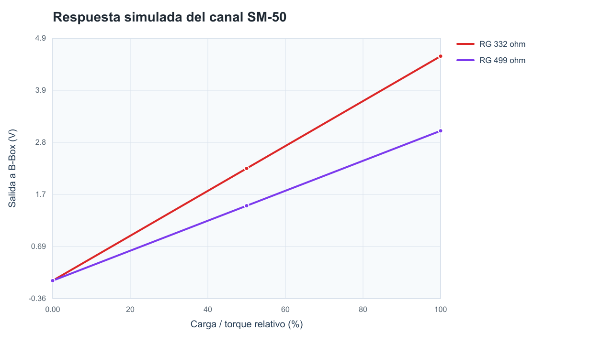
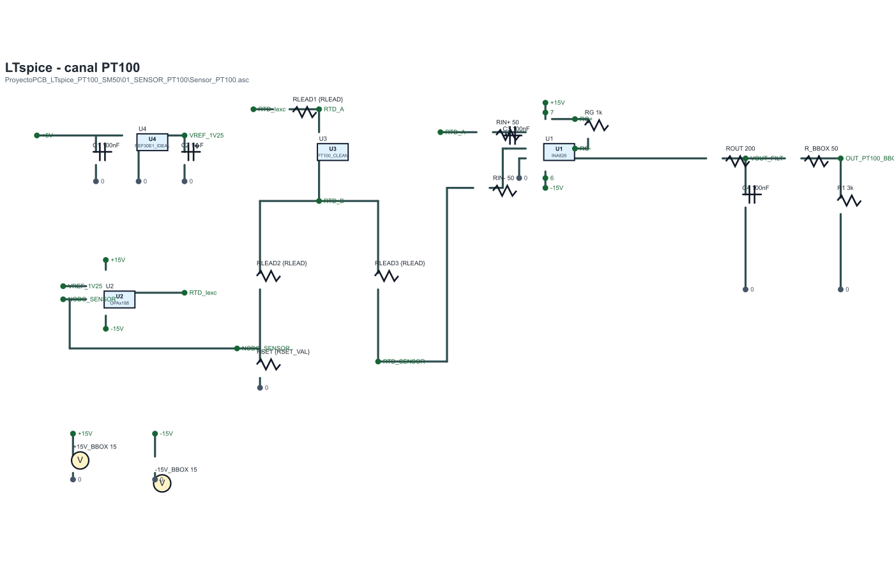
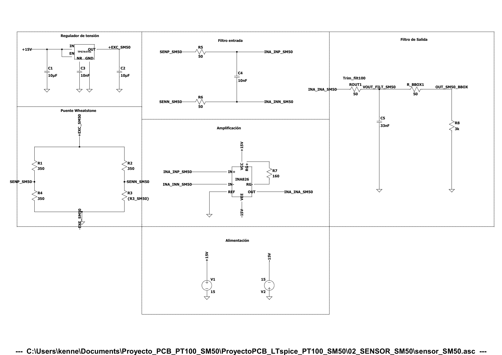

# Tarjeta de acondicionamiento de senales PT100 y SM-50

Diseño implementación de una tarjeta de acondicionamiento de señales para sensores de torque y temperatura en un motor de inducción trifásico del LabCES. La PCB adapta las señales de un sensor de temperatura PT100 y un sensor de torque SM-50 para facilitar su adquisicion y monitoreo dentro de un sistema de medición.

## Objetivo

Diseñar e implementar una tarjeta de circuito impreso que permita acondicionar y adaptar las señales provenientes de los sensores de torque y temperatura de un motor de inducción utilizado en el LabCES, con el proposito de facilitar su correcta adquisición y monitoreo para analizar el desempeño del motor.

## Objetivos específicos

1. Comprender los fundamentos básicos del diseño de tarjetas de circuito impreso y su aplicacion al acondicionamiento de señales usando KiCad.
2. Verificar el funcionamiento de los sensores de torque y temperatura mediante simulaciones y pruebas experimentales.
3. Diseñar una PCB que integre el circuito necesario para acondicionar las señales de los sensores.
4. Implementar y probar el prototipo, evaluando su desempeño dentro del sistema de medición del motor de inducción en el LabCES.
5. Mantener un repositorio Git con archivos de diseño electrónico, documentación técnica e historial de desarrollo.

## Vista del diseno

### Esquematico KiCad

### PCB en KiCad

### PCB 3D

## Simulaciones

### Canal PT100

### Canal SM-50

### Esquematicos LTspice

[PDF PT100](docs/figuras/ltspice_pt100_esquematico.pdf)

[PDF SM-50](docs/figuras/ltspice_sm50_esquematico.pdf)

## Estructura del repositorio

| Ruta | Contenido |
| --- | --- |
| `PCB_PT100_SM50/` | Proyecto KiCad principal: esquematico, PCB, librerias locales, footprints y modelos 3D. |
| `ProyectoPCB_LTspice_PT100_SM50/` | Simulaciones LTspice de los canales PT100 y SM-50. |
| `docs/figuras/` | Imagenes/PDF del esquematico, PCB, vista 3D, LTspice y graficas. |
| `docs/simulacion/` | CSV y resumen numerico usados para generar las graficas. |
| `docs/validacion/` | Reportes finales ERC/DRC. |
| `docs/fabricacion/` | ZIP Gerber final con archivo de taladros. |
| `docs/referencias/` | Resumen de verificacion de footprints y documentos de entrega conservados. |
| `scripts/` | Script para regenerar figuras de simulacion y vistas documentales LTspice. |

## Estado final

- KiCad ERC: `0` errores, `0` advertencias.
- KiCad DRC: `0` violaciones, `0` pads desconectados, `0` errores de footprints.
- Paridad esquematico-PCB: `0` problemas.
- ZIP para fabricar: `docs/fabricacion/PCB_PT100_SM50_GERBERS_CON_DRILL.zip`.
- Reportes: `docs/validacion/erc_final_20260626.rpt` y `docs/validacion/drc_final_20260626.rpt`.

## Como revisar

1. Abrir `PCB_PT100_SM50/PCB_PT100_SM50.kicad_pro` en KiCad 9.
2. Ejecutar ERC desde el editor esquematico.
3. Ejecutar DRC con comprobacion de paridad esquematico-PCB desde el editor PCB.
4. Revisar las simulaciones en `ProyectoPCB_LTspice_PT100_SM50/`.
5. Subir a fabricacion el ZIP `docs/fabricacion/PCB_PT100_SM50_GERBERS_CON_DRILL.zip` si se requiere fabricar esta revision.

## Documentacion

- [Proceso de diseno y trazabilidad](docs/PROCESO_DISENO_CHATGPT.md)
- [Validacion final](docs/VALIDACION.md)
- [Referencias tecnicas y footprints](docs/REFERENCIAS_TECNICAS.md)

## Herramientas

- KiCad 9.0.7
- LTspice
- Python 3 para generar figuras documentales
- Git / GitHub
